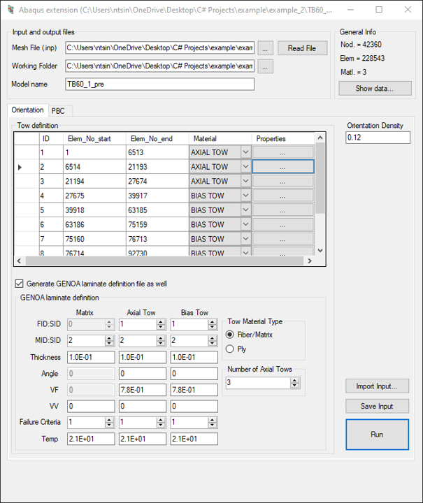
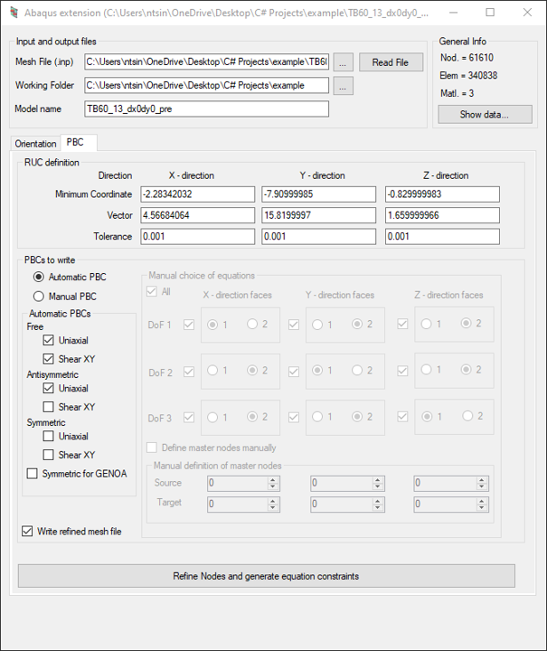
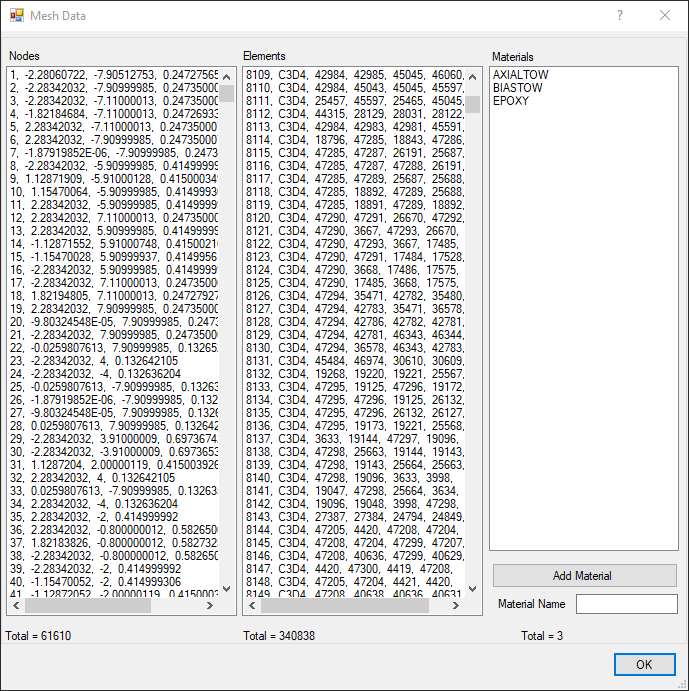
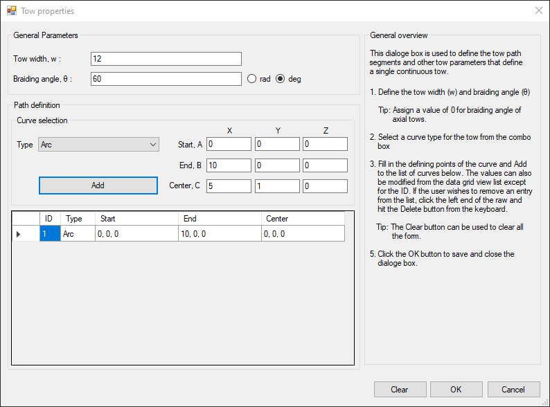

# Abaqus_extension

Abaqus_extension is a C# project designed to extend the functionality of the Abaqus finite element analysis (FEA) software suite. The repository includes libraries and tools to facilitate the manipulation, enhancement, and automation of Abaqus input files, particularly for mesh and assembly operations.

## Features

- **Mesh and Assembly Management:** Classes like `aAssembly`, `aElement`, `aNode`, and `aTow` provide programmatic access and processing for nodes, elements, materials, sections, orientations, and more, enabling sophisticated manipulation of Abaqus models.
- **Input/Output Automation:** The `aIO` class manages reading and writing of Abaqus input files, allowing automated modification and generation of files with additional information required for advanced simulations.
- **Periodic Boundary Conditions (PBC):** Support for applying periodic boundary conditions programmatically via the `ApplyPBCs` method.
- **Extensible Data Structures:** The library provides extensible data structures for finite element nodes, elements, element sets, node sets, and composite tows, aiding in the construction and modification of complex assemblies.
- **Integration with Math Libraries:** Dependencies include MathNet.Numerics and FSharp.Core, facilitating numerical computation and mathematical operations within the extension.

## Graphical User Interface (GUI)

Main interface (Orientation):



Main interface (Periodic-boundary-condition (PBC)):



View mesh data:



Define tow properties:



## Directory Structure

- `AbaqusExtension/` — Core library with classes for assembly, elements, mesh, and IO operations.
- `AbaqusExtension_GUI/` — (Optional) GUI layer for interactive use, including resources and form logic.
- `LICENSE` — MIT License.

## Getting Started

1. Clone the repository:
   ```bash
   git clone https://github.com/Tsinuel/Abaqus_extension.git
   ```
2. Open the solution in Visual Studio (2012 or 2015 recommended).
3. Restore NuGet packages (MathNet.Numerics, FSharp.Core).
4. Build the solution.
5. Use the compiled libraries or the GUI (if present) to interact with Abaqus input files.

## License

This project is licensed under the MIT License. See the [LICENSE](LICENSE) file for details.

## Contributing

Contributions, bug reports, and feature requests are welcome! Please open issues or submit pull requests.

## Disclaimer

This project is not affiliated with or endorsed by Dassault Systèmes or the Abaqus software team.
